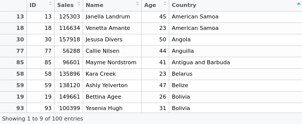
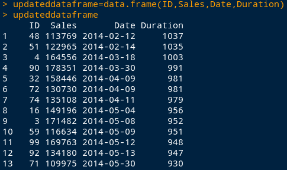
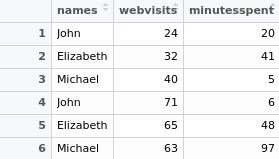
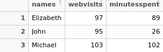

[Home](https://mgcodesandstats.github.io/) |
[GitHub](https://github.com/mgcodesandstats) |
[LinkedIn](https://www.linkedin.com/in/michaeljgrogan/) |
[Medium](https://mgcodesandstats.medium.com/) |
[Stack Overflow](https://stats.stackexchange.com/users/137066/michael-grogan) |
[Terms](https://mgcodesandstats.github.io/terms/) |
[E-mail](mailto:contact@michael-grogan.com)

# Data Cleaning, Merging, and Wrangling in R

One of the big issues when it comes to working with data in any context is the issue of data cleaning and merging of datasets, since it is often the case that you will find yourself having to collate data across multiple files, and will need to rely on R to carry out functions that you would normally carry out using commands like VLOOKUP in Excel.

## Data Cleaning and Merging Functions

For examples 1-7, we have two datasets:

- **sales:** This file contains the variables Date, ID (which is Product ID), and Sales. We load this into R under the name mydata.
- **customers:** This file contains the variables ID, Age, and Country. We load this into R under the name mydata2.

The following are examples of popular techniques employed in R to clean a dataset, along with how to format variables effectively to facilitate analysis. The below functions work particularly well with panel datasets, where we have a mixture of cross-sectional and time series data.

**1. Storing variables in a data frame**

To start off with a simple example, let us choose the customers dataset. Suppose that we only wish to include the variables ID and Age in our data. To do this, we define our data frame as follows:

```
dataframe<-data.frame(ID,Age)
```

**2. Mimic VLOOKUP by using the merge functions**

Often times, it is necessary to combine two variables from different datasets similar to how VLOOKUP is used in Excel to join two variables based on certain criteria. If you are unfamiliar with the VLOOKUP function, then you might find this guide from Spreadsheeto particularly helpful.

In R, this can be done using the merge function.

For instance, suppose that we wish to link the Date variable in the sales dataset with the Age and Country variables in the customers dataset – with the ID variable being the common link.

Therefore, we do as follows:

```
mergeinfo<-merge(mydata[, c("ID", "Sales")],mydata2[, c("ID", "Age", "Country")])
```

Upon doing this, we see that a new dataset is formed in R joining our chosen variables:



**3. Using as.date to format dates and calculate duration**

Suppose that we now wish to calculate the number of days between the current date and the date of sale as listed in the sales file. In order to accomplish this, we can use as.date as follows:

```
currentdate=as.Date('2016-12-15')
dateinfile=as.Date(Date)
Duration=currentdate-dateinfile
```

Going back to the example above, suppose that we now wish to combine this duration variable with the rest of our data.

Hence, we can now combine our new Duration variable with the merge function as above, and can do this as follows:

```
durationasdouble=as.double.difftime(Duration, units='days')
updateddataframe=data.frame(ID,Sales,Date,durationasdouble)
updateddataframe
```


 
**4. Using as.POSIXct and format to calculate differences between seconds**

While it is not the case in the above example, a situation can often occur where we have dates which include the time, e.g. “2016-10-13 19:30:55”.

There may be times where we wish to find differences between seconds of two dates. In this regard, as.POSIXct is a more suitable option than as.Date. For instance, we can first format our date as follows:

```
date_converted<-format(Date, format="%Y-%m-%d %H:%M:%S")
new_date_variable<-as.POSIXct(date_converted)
seconds<-diff(new_date_variable,1)
```

When we define our seconds variable, it will now give us the difference between two dates in seconds. Then, it is a matter of simple arithmetic to obtain the difference in minutes and seconds.

```
minutes<-seconds/60
hours<-minutes/60
```

**5. grepl: Remove instances of a string from a variables**

Let us look to the Country variable. Suppose that we wish to remove all instances of “Greenland” from our variable. This is accomplished using the grepl command:

```
countryremoved<-mydata2[!grepl("Greenland", mydata2$Country),]
```

**6. Delete observations using head and tail functions**

The head and tail functions can be used if we wish to delete certain observations from a variable, e.g. Sales. The head function allows us to delete the first 30 rows, while the tail function allows us to delete the last 30 rows.

When it comes to using a variable edited in this way for calculation purposes, e.g. a regression, the as.matrix function is also used to convert the variable into matrix format:

```
Salesminus30days←head(Sales,-30)
X1=as.matrix(Salesminus30days)
X1
 
Salesplus30days<-tail(Sales,-30)
X2=as.matrix(Salesplus30days)
X2
```

**7. Replicate SUMIF using the “aggregate” function**

```
names <- c("John", "Elizabeth", "Michael", "John", "Elizabeth", "Michael")
webvisitsframe <- cbind("24","32","40","71","65","63")
webvisits=as.numeric(webvisitsframe)
minutesspentframe <- cbind("20", "41", "5", "6", "48", "97")
minutesspent=as.numeric(minutesspentframe)
```

Let us suppose that we have created the following table as below, and want to obtain the sum of web visits and minutes spent on a website in any particular period:



In this instance, we can replicate the SUMIF function in Excel (where the values associated with a specific identifier are summed up) by using the aggregate function in R. This can be done as follows (where raw_table is the table specified as above):

```
sumif_table<-aggregate(. ~ names, data=raw_table, sum)
sumif_table
```

Thus, the values associated with identifiers (in this case, names) are summed up as follows:



As per the examples at Stack Overflow, the plyr and data.table libraries can also be used to accomplish the same result as follows:

```
library(plyr)
ddply(nametable, .(names), summarise, Sum_webvisits = sum(webvisits), Sum_minutesspent = sum(minutesspent))
 
library(data.table)
DT <- as.data.table(nametable)
DT[ , lapply(.SD, sum), by = "names"]
```

**8. Calculate lags using the diff() function**

When it comes to doing time series analysis, often times it is necessary to calculate lags for a specific variable. To do this in R, we use the diff() function.

For the purposes of this example, we create a matrix with price data for the column names, along with years as our row names:
 
```
pricedata <- matrix(c(102, 90, 84, 130, 45), ncol=1)
colnames(pricedata) <- c('Price')
rownames(pricedata) <- c('2012', '2013', '2014', '2015', '2016')
pricedata.table <- as.table(pricedata)
pricedata.table
Year	Price
2012	102
2013	90
2014	84
2015	130
2016	45
2. Lag = 1

diff(pricedata.table,1)
Year	Price
2013	-12
2014	-6
2015	46
2016	-85
3. Lag = 2

diff(pricedata.table,2)
Year	Price
2014	-18
2015	40
2016	-39
4. Differences = 2

diff(pricedata.table,differences=2)
Year	Price
2014	6
2015	52
2016	131
```

**9. Separating by list (useful for panel datasets)**

Suppose we have a dataset that needs to be separated, e.g. by ID. Doing this manually would make for quite a messy process. Instead, we can do so using the unique and split functions to form a list. Here is an example of how this would be done.

Using a data frame of dates, names, and IDs:

```
> Date<-c("20/02/2017","21/02/2017","22/02/2017","20/02/2017","21/02/2017","22/02/2017")
> ID<-c("20","20","20","40","40","40")
> Name<-c("Brian","Brian","Brian","Adam","Adam","Adam")
> df<-data.frame(Date,ID,Name)
> df
        Date ID  Name
1 20/02/2017 20 Brian
2 21/02/2017 20 Brian
3 22/02/2017 20 Brian
4 20/02/2017 40  Adam
5 21/02/2017 40  Adam
6 22/02/2017 40  Adam
``` 

However, we would like to separate the observations into two separate lists by filtering by ID. We would do this as below:

```
> listofids=as.character(unique(df$ID))
> mylist <- split(df, df$ID)
> mylist
 
$`20`
        Date ID  Name
1 20/02/2017 20 Brian
2 21/02/2017 20 Brian
3 22/02/2017 20 Brian

$`40`
        Date ID Name
4 20/02/2017 40 Adam
5 21/02/2017 40 Adam
6 22/02/2017 40 Adam
```

This is the list in its entirety. If we wished to call one at a time (by ID as our unique identifier, we can do so as follows:

```
> mylist[1]
$`20`
        Date ID  Name
1 20/02/2017 20 Brian
2 21/02/2017 20 Brian
3 22/02/2017 20 Brian
> mylist[2]
$`40`
        Date ID Name
4 20/02/2017 40 Adam
5 21/02/2017 40 Adam
6 22/02/2017 40 Adam
```
